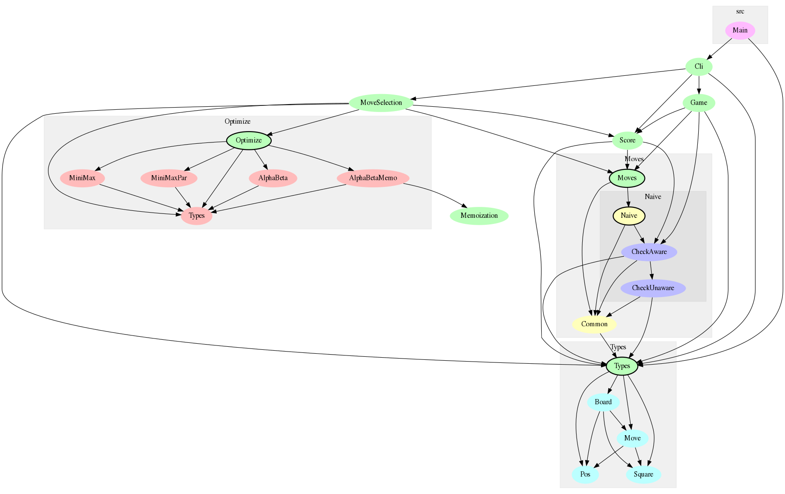

# Chess

Chess AI written in Haskell.

# Documentation

## Source code overview

This section provides an overview and introduction to the design and architecture of the program.



The diagram is generated with `~/.cabal/bin/graphmod | dot -Gdpi=300 -Tpng > doc/modules.png`

`Types` contains the data representations of a chess board and chess moves. The `Board` type contains the entire state at a given point in time:
- Which piece, if any, a square contains
- Whether a castling move is possible
- Whether it's white's or black's turn

`Moves` generates all possible moves for a given board. The `Naive` module is a simple move generation algorithm that first generates all pseudo-legal moves using `CheckUnaware` and then filters the moves that result in check using `CheckAware`. It's not the most efficient algorithm, but it can be used as comparison for better algorithms using property-based testing.

`Score` calculates the score of a given board. It also takes into account if the current player is in check, checkmate or it's a draw.

`Optimize` is a general implementation of the [Minimax](https://en.wikipedia.org/wiki/Minimax) algorithm. The submodules are different variants of it, with `AlphaBetaMemo` being the fastest one and thus the one used in the rest of the program. Using property-based testing, it's verified that all implementations give the same result.

`MoveSelection` is the composition of `Moves`, `Score` and `Optimize`. I.e. Minimax applied to chess, where `Moves` is the state generator and `Score` the state evaluator. `MoveSelection` provides a single function: `selectMove :: Int -> Board -> Move` that given a search depth and a board, finds the "best" move. The move selection is tested for a number of boards of interesting situations where there exists an obvious best move. It's verified that `selectMove` indeed makes that obvious best move. For example, consider the board below (black's turn) from `MoveSelection.Tests.prop_checkmate`.

```
  a b c d e f g h
8 ♔   ♝           8
7     ♟           7
6     ♟           6
5     ♟           5
4     ♟         ♚ 4
3     ♟           3
2   ♜ ♟           2
1   ♜ ♞           1
  a b c d e f g h
```

It's obvious that the best move is b1->a1 or b2->a2. The test verifies that `selectMove` move picks one of those moves. If `selectMove` doesn't make these obvious moves, something must be wrong.

`Game` contains the game state for a human playing against the computer. It's UI-agnostic.

`Cli` provides a command line interface for letting a human play against the computer.

`Main` is a thin entry point to `Cli`.

# Ideas to work in

- Rules
    - Promoting
        - ~~Initial implementation~~
        - ~~Fix missunderstood behavior~~
    - Castling
        - ~~Stateless~~
        - ~~Remember if rooks/king have been moved~~
    - En passant
- Move generation
    - ~~Don't generate illegal moves from the start.
      https://peterellisjones.com/posts/generating-legal-chess-moves-efficiently/ ~~ Won't do because it changes the board representation too much, and part of the reason for this project is to use the current board representation for fun. 
- Move selection
    - ~~fix the issue about move order, i.e. that need to do what is short-term
      good as well, otherwise the good move is "procrastinated" forever.~~
- Score
    - Give more weight to squares in the center
    - Take into account the number of attacked squares
    - Numbers of possible moves, hard coded for when the opponent has few pieces left
- Testing
    - More invariants for e.g. Board
    - More unit tests for move generation, move selection, and everything else
    - Test that within, say 10, moves, the computer manages checkmate. Could be useful for endgames
- Move selection tests
    - Checkmate with King+Rook
    - Checkmate with King+Queen
    - End game scenarios, with few pieces remaining. Check that the algorithm
    - Can checkmate within reasonable steps.
- Misc
    - ~~Moves are re-calculated so many times. For generating check aware moves,
      calculating game result, calculating the score, etc. This should be
      optimized~~
      - For making check aware: yes, that's the big cost. But after some math, only 2% is saved if the moves generated are re-used for the next depth. So it's not worth it.
      - Checking if can move at all: since only one move is needed, it's cheap anyway (due to laziness) when there are many moves. And if not many moves, probably few pieces, so cheap in that case too.
      - Checking if threatened: mainly relevant for UI, so that part is optimized. The other time is for checking if a draw if current player can't make a move. But such cases are not that common.
      - Conclusion: with the current board representation, can't optimize this more.
    - ~~Move Score to top-level~~
    - ~~Test promotes with MoveSelection~~
- Performance
    - Try to make other parts of move generation and score parallel. Note that I haven't been able to make Cabal run parallel at all yet. So I don't know if MiniMaxPar actually is faster than MiniMax.
    - Note: I tried Data.MemoTrie, but it consumed several gigabytes, so it wasn't practical. But see the memotrie branch. So efficient calculation might be needed after all if caching is infeasable. Unclear if AlphaBetaMemo is good.

# Dev

cabal repl --ghc-options="-fobject-code -O2"
